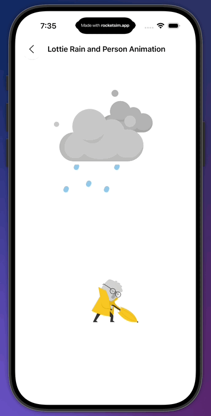

# LottieDemo

Animation Demos using **Lottie + SwiftUI**

A simple demo project to showcase how to integrate and display Lottie animations in a SwiftUI app. This is useful as a reference or starting point for adding animated content (loading screens, icon animations, etc.) to your iOS projects.

---

## 📦 Features

- Example of embedding Lottie JSON animations into SwiftUI views  
- Multiple animations (e.g. loading spinner, icons, rain / person etc.)  
- Demonstrates how to play, loop, and control Lottie animations in SwiftUI  
- Clean structure so you can extend it to your own animations easily  

---

## 🧰 Requirements

- Xcode 12+ (or higher)  
- iOS 13+ (or your target deployment)  
- Swift 5  
- [Lottie iOS library](https://github.com/airbnb/lottie-ios) (via Swift Package Manager or CocoaPods)  

---

